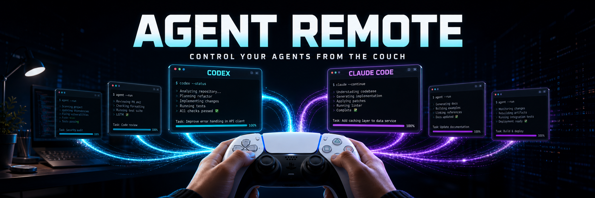
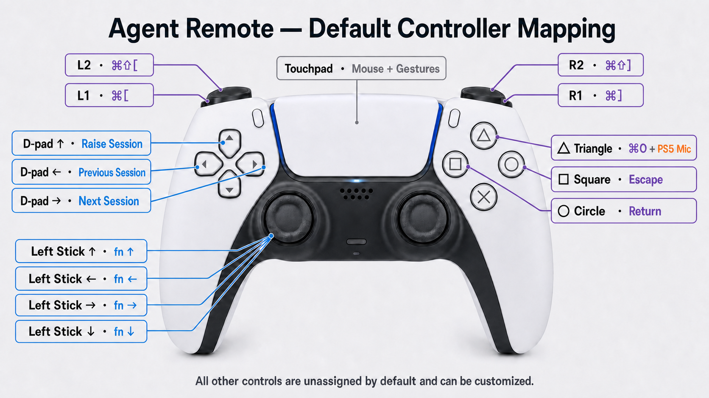

# Agent Remote



Agent Remote turns a Sony DualSense controller into a physical remote control
for coding agents on macOS — Codex CLI, Claude Code, or anything that can run
a shell hook. It is a small, native, local-only menu-bar app.

- **Lightbar shows agent state.** Working, needs-attention, done, error, and
  idle each get a configurable color.
- **Haptic alerts.** The controller taps your hands when an agent needs
  approval and confirms when a turn finishes — patterns, strength, and an
  optional repeating attention reminder are configurable.
- **Push-to-talk through the controller microphone**, including over
  Bluetooth via the project's own Opus-over-HID decode and bundled virtual
  audio driver.
- **Full trackpad emulation** on the touchpad: pointer, taps, two-finger
  scroll, drag, and macOS Spaces switching.
- **27 mappable controls**: 19 buttons plus eight virtual stick directions,
  each assignable to a Fleet action, key, or shortcut.

Agent Remote is pre-1.0 software. The source, tests, packaging scripts, and
virtual microphone driver are open for review; hardware behavior can still
vary across controller firmware and macOS releases.

## Requirements

- macOS 13 or newer
- A standard Sony DualSense controller (USB or Bluetooth, VID `054c`, PID
  `0ce6`); DualSense Edge is not currently claimed as supported
- Xcode 16 or newer with Swift 6 for source builds
- Homebrew Opus (`brew install opus`) for packaging Bluetooth microphone
  support

## Agent feedback

Choose **Agent Feedback** from the menu-bar icon to configure everything:

- **Lightbar Shows Agent State** with per-state colors under
  **Lightbar Colors** (defaults: working purple, attention amber, done green,
  error red, idle off). Done and error revert to the idle color after a few
  seconds; attention holds until the next event.
- **Haptic Alerts** with per-event patterns (Tap, Double Tap, Buzz, or Off),
  a global **Haptic Strength**, and an optional **Attention Reminder** that
  re-pulses every 15/30/60 seconds while an agent is waiting on you.
- **Test Agent Feedback** plays a synthetic working → attention → done
  sequence so mappings can be tuned without a live agent.
- **A persistent focus marker on the player LEDs**: Sony's standard patterns
  show one through five illuminated dots for Fleet positions F1 through F5.
  With more than five sessions, the count repeats on a new page and the
  Sessions menu labels the page. This works on newer DualSense revisions
  whose inner and outer LED pairs cannot be controlled independently. Agent
  state remains on the lightbar, haptics, and menu.
- **Fleet controls** (semantic actions, remappable in **Button Mapping** or
  under **Fleet Controls**): d-pad ←/→ cycles controller focus through live sessions
  (changing the persistent player-LED count), and d-pad ↑
  raises the focused session's window — the transcript's writing process
  is traced to its owning app (Ghostty's official automation API selects the
  tab/split by full working directory; ChatGPT/Codex desktop sessions open
  their exact task through its registered deep link). A button bound to a fleet
  action never emits a keystroke, so a fleet control can never type into
  the wrong window. Clicking a session in the **Sessions** menu focuses
  and raises it; "▶" marks controller focus. Focus follows attention
  automatically unless you cycled within the last 30 seconds. The full
  design — states, focus paging, resolver strategy, troubleshooting, and
  roadmap — is documented in [`docs/fleet.md`](docs/fleet.md).

Feedback works on every connection path: raw Bluetooth HID, raw USB HID, and
the GameController-framework fallback (lightbar via `GCDeviceLight`, haptics
via CoreHaptics). Haptics are deliberately suppressed while the Bluetooth
microphone is streaming — rumble reports switch the controller's haptics
mode, and audio capture must never be disturbed mid-dictation. The microphone
session's own blue/amber lightbar indicators take priority while recording.

### Connecting agents

**No setup is required.** By default, **Watch Sessions Automatically** is on:
the app passively observes the session transcripts that Claude Code
(`~/.claude/projects`) and Codex (`~/.codex/sessions`) already write —
strictly read-only, via file-system events. Nothing is installed, no harness
configuration is touched, and nothing runs in the harness's execution path,
so this mode cannot affect a session by construction. It covers every
session in every terminal tab automatically.

Agent Remote has no telemetry or network client. Transcript-derived data stays
on the Mac; the exact files, retention, permissions, and removal steps are
documented in [`PRIVACY.md`](PRIVACY.md).

What passive watching can and can't tell:

- **Working, done, and Codex approval requests** are derived from explicit
  transcript structure and behave exactly like reported events.
- **Claude Code "needs attention" is a timing heuristic** — a pending tool
  call in a transcript that has gone quiet for ~20 seconds. A permission
  prompt and a slow build look identical from the outside, so inferred
  attention changes the lightbar but never buzzes; haptic attention alerts
  come only from installed hooks, which know the difference.

For hook-level precision, the menu still offers opt-in setup, each with a
confirmation and an automatic backup of the edited file:

- **Install Claude Code Hooks…** adds commands to `~/.claude/settings.json`
  for `UserPromptSubmit` → working, `Notification` → attention, `Stop` →
  done, and `SessionEnd` → idle.
- **Connect Codex Notifications…** sets the top-level `notify` entry in
  `~/.codex/config.toml`. Codex supports a single notify program, so an
  existing entry would be replaced (after backup) — prefer passive watching
  if you already use one. Running hooks and passive watching together is
  fine; duplicate events within a few seconds are coalesced.

Both hook integrations call the bundled helper
`Agent Remote.app/Contents/Resources/agent-remote-event`, which writes an
event file into
`~/Library/Application Support/DualSenseBridge/agent-events/`. Any other
tool can drive the controller the same way:

```sh
"/path/to/Agent Remote.app/Contents/Resources/agent-remote-event" attention my-tool
```

Valid events are `working`, `attention`, `done`, `error`, and `idle`. Hook
events are last-writer-wins; with several parallel sessions the controller
reflects the most recent event. Passive watching aggregates instead: the bar
holds the most demanding state across sessions, and a session finishing (or
raising a second approval) while another still works fires its haptic and
flashes its color for a couple of seconds before the bar returns to the
sustained state. To disconnect an integration, remove the lines
containing `agent-remote-event` from the file (a `.agent-remote-backup`
copy of the pre-install file sits alongside it).

## Pointer, gestures, and buttons

### Default controller mapping



This field-tested preset ships on first launch and is restored by **Restore
Defaults**. Every assignment can be customized in **Button Mapping**.

- Move one finger to move the pointer.
- Tap one finger for a left click; repeated taps work as double-clicks.
- Move two fingers to scroll.
- Tap two fingers for a right click.
- Press the left side of the touchpad for a left click.
- Press while two fingers are down for a right click. The optional **Right Side
  Press = Right Click** menu setting also makes a press on the right side act
  as a right click.
- Hold the touchpad down and move a finger to drag.
- Hold the touchpad down with two fingers and swipe left or right to switch
  between macOS Spaces, mirroring the Mac trackpad's three-finger gesture.
- Map all 19 pressable controls plus eight virtual stick directions to a Fleet
  action, key, or keyboard shortcut: Triangle, Square, Cross, Circle, D-pad
  directions, L1/L2/R1/R2, L3/R3, both sticks' Up/Right/Down/Left directions, Create,
  Options, PS, Touchpad Click, and Mute. The shipped profile is the maintainer's
  field-tested layout: Triangle sends Command-O with the DualSense mic, Square
  sends Escape, Circle sends Return, L1/R1 send Command-[ / Command-], L2/R2
  send Command-Shift-[ / Command-Shift-], the left stick sends fn-arrow
  navigation, and D-pad Left/Right/Up control Fleet previous/next/raise.
- Touchpad Click shows **Mouse Click (Built-in)** and retains its normal
  mouse-click behavior until a shortcut is assigned to it. Stick directions
  use hysteresis around the center to prevent
  drift from firing shortcuts, and repeat while held using the Mac's current
  Keyboard repeat delay and rate. Pressing the sticks remains separately
  exposed as L3 and R3.
- Enable **Use PS5 Mic** beside any mapping to select and unmute the controller's
  audio input before its shortcut is sent. USB uses the controller's native
  Core Audio input. Bluetooth audio is decoded by Agent Remote and sent to
  the bundled **DualSense Bridge Mic** virtual input.

Motion data and adaptive-trigger effects are not converted into keyboard
shortcuts by this app.

## Build and run

Install Xcode's command-line tools and Opus, then package the app for the
current CPU architecture:

```sh
brew install opus
./scripts/package-app.sh
open "dist/Agent Remote.app"
```

The script verifies that the Swift executable and bundled Opus library match
the requested architecture. Native Apple-silicon and Intel packages are built
separately; set `AGENT_REMOTE_BUILD_ARCH=arm64` or `x86_64` only when
`OPUS_PREFIX` points to a matching Opus installation.

On first launch, allow **Agent Remote** in **System Settings → Privacy &
Security → Accessibility**. This permission is required for any app that emits
system mouse events. Use the game-controller icon in the menu bar to change
pointer speed, scrolling direction, right-click behavior, or launch-at-login.
Choose **Button Mapping…** from that menu to inspect or change every effective
assignment, including Fleet controls. A keyboard mapping can contain one key
plus Command, Option, Control, Shift, or Fn modifiers, and is sent to whichever
app currently has keyboard focus. Fleet assignments are semantic and never
emit the button's stored shortcut. Use **Choose…** to select the key and
modifiers manually when a global shortcut such as Command-O is intercepted
before the recorder can see it. **Restore Defaults** restores the complete
shipped profile, including microphone and Fleet assignments.

For Bluetooth microphone support, choose **Install/Update Open-Source
Bluetooth Mic Driver…** from the menu-bar icon once. macOS asks for an
administrator password because Core Audio drivers live in
`/Library/Audio/Plug-Ins/HAL`; system audio restarts briefly after installation.
Updates are staged and verified before the live driver changes. Use
**Uninstall Bluetooth Mic Driver…** from the same menu to remove it safely.
The app only recognizes the bundled `DualSenseBridgeMic_UID` device. It does
not use or fall back to MetaVoice, BlackHole, or another separately installed
audio cable.

The menu's **Bluetooth Mic Sound** setting defaults to **Natural**, which keeps
the controller microphone array's beamforming but disables its aggressive
voice-chat noise cancellation before the Opus stream is encoded. **Sony Voice
Chat** remains available for direct comparison; a sound-mode change made while
recording applies to the next take.

For continued local development, configure the project-local signing
identity once before packaging:

```sh
./scripts/setup-local-signing.sh
./scripts/package-app.sh
```

The certificate is self-signed, trusted only for code signing, and its private
key is stored in the ignored `.local-signing` directory. Keeping that identity
stable lets macOS preserve Accessibility approval across rebuilt versions. If
local signing has not been configured, packaging falls back to an ad-hoc
signature and rebuilding may require fresh approval. Ad-hoc signing is valid
for open-source, build-from-source use: it seals code integrity but does not
provide a publisher identity or Apple notarization. See
[`docs/RELEASING.md`](docs/RELEASING.md) before sharing an app archive.

## Verify

```sh
mkdir -p .build/ModuleCache
export SWIFTPM_MODULECACHE_OVERRIDE="$PWD/.build/ModuleCache"
export CLANG_MODULE_CACHE_PATH="$PWD/.build/ModuleCache"
swift test \
  --disable-sandbox \
  --scratch-path .build \
  -Xswiftc -module-cache-path \
  -Xswiftc .build/ModuleCache
```

Requires macOS 13 or newer. DualSense works over USB or Bluetooth when macOS
recognizes it as a game controller. On Bluetooth, the bridge enables the
controller's full input report so touchpad gestures remain available and
transports the built-in microphone's Opus frames over HID.

Contributor setup, test expectations, and the hardware verification matrix are
in [`CONTRIBUTING.md`](CONTRIBUTING.md). Security reports follow
[`SECURITY.md`](SECURITY.md).

## Open-source components

The application code, installer, and loopback-driver changes are released
under the MIT license in [`LICENSE`](LICENSE). Apple NullAudio, Opus, Sonic,
yabai, and the protocol-research references are documented in
[`THIRD_PARTY_NOTICES.md`](THIRD_PARTY_NOTICES.md); every distributed
component's required license text is copied into packaged apps. No proprietary
virtual audio cable is installed or required.

DualSense and PlayStation are trademarks of Sony Interactive Entertainment.
Agent Remote is an independent community project and is not affiliated with,
endorsed by, or sponsored by Sony, OpenAI, Anthropic, or the Ghostty project.
